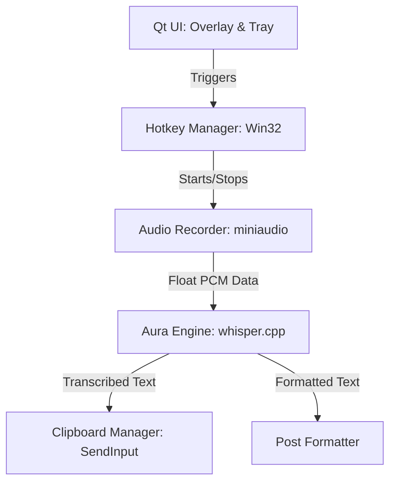

# Aura Flow Developer Documentation 🛠️

This document describes the internal architecture and build process of the Aura Flow C++ version.

## Architecture Overview

Aura Flow is a native Windows application built with **Qt 6** and **C++17**, utilizing a specialized engine for offline speech transcription.

### Component Diagram


### Core Components

1.  **Aura Engine (`src/engine/`)**:
    - A wrapper around `whisper.cpp`.
    - Supports hot-reloading GGML models.
    - Optimized for CPU using **AVX2** and **OpenMP**.
    - Thread-safe: Uses an `isBusy` flag to prevent concurrent inference.

2.  **Audio Recorder (`src/audio/`)**:
    - Uses the header-only `miniaudio.h` library.
    - Captures WASAPI system audio or microphone.
    - Maintains a thread-safe circular buffer of float samples (16kHz, Mono).

3.  **UI System (`src/ui/`)**:
    - **OverlayWindow**: A frameless, translucent window with custom `paintEvent` animations.
    - **SystemTray**: Handles mode selection (RU, EN, Post) and model selection.
    - All UI updates from background threads must use `QMetaObject::invokeMethod` to ensure thread safety.

4.  **System Integration (`src/system/`)**:
    - **HotkeyManager**: Registry-based Windows hotkeys (`RegisterHotKey`).
    - **ClipboardManager**: Uses the Win32 `SendInput` API for virtual keystroke injection, enabling "paste-less" text insertion.

## Build System (CMake)

The project uses CMake for cross-platform potential, although currently targeted at Windows/MSVC.

### Key Compiler Flags:
- `/arch:AVX2`: Required for high-speed tensor operations on CPU.
- `/openmp`: Enables multi-threaded parallelization for the Whisper engine.
- `WIN32_EXECUTABLE`: Set to `TRUE` in Release to hide the console window.

## Dependencies

- **Qt 6.5+**: (Widgets, Gui, Core).
- **whisper.cpp**: Included via git submodules in `3rdparty/`.
- **miniaudio**: Single-header dependency (included in `src/audio/`).

## How to Set Up a Dev Environment

1.  **Prerequisites**:
    - Visual Studio 2022.
    - Qt 6.5.3 LTS (MSVC 2019 64-bit).
    - CMake 3.20+.

2.  **Cloning**:
    ```bash
    git clone https://github.com/dragoundead/aura-flow.git --recursive
    ```

3.  **Compilation**:
    - Open the folder in Visual Studio (Open Folder -> CMake).
    - Select `x64-Release` configuration.
    - Build -> Build All.

## Continuous Integration (GitHub)

The `.gitignore` is configured to ignore:
- `/out/` and `/build/` directories.
- Large `.bin` model files.
- Visual Studio personal settings (`.vs`).

## Developer Rules for UI Threading
> [!IMPORTANT]
> Never call UI methods (like `overlay->show()`) directly from a transcription thread. Always use:
> ```cpp
> QMetaObject::invokeMethod(overlay.get(), "methodName", Qt::QueuedConnection);
> ```
